# Fluxos do Sistema SEG — Gold Transportes v2.0

Diagramas Mermaid de todos os processos principais com rastreamento de tabelas e campos.
Renderize em qualquer editor compatível (GitHub, VS Code + extensão Mermaid, Notion, Obsidian).

---

## Mapa de Interligações

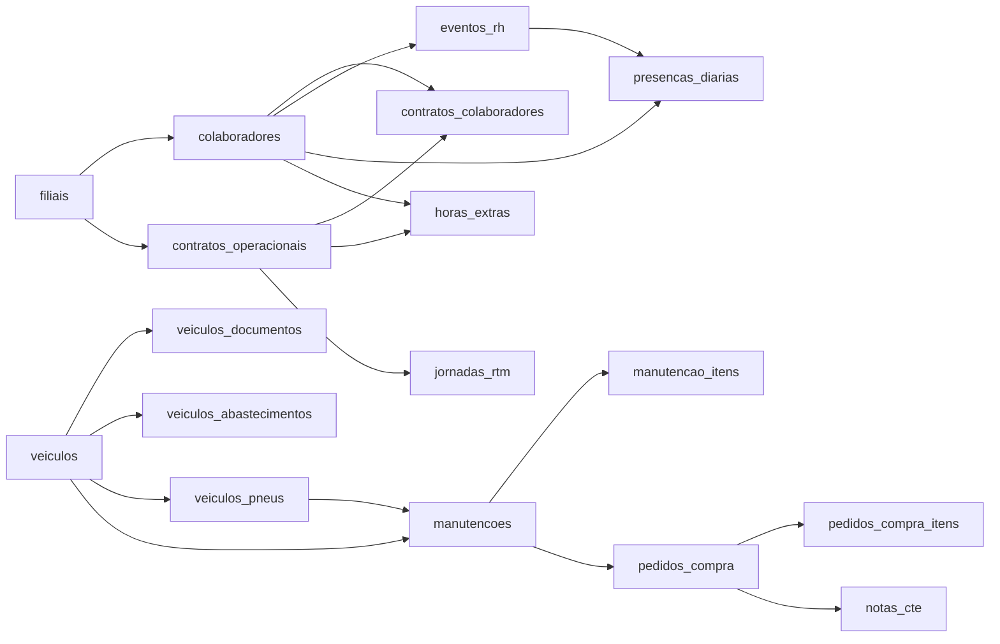

---

## 1. Admissão de Colaborador (RH)

**Início:** Aprovação da vaga &nbsp;→&nbsp; **Fim:** Colaborador ativo com acesso ao sistema

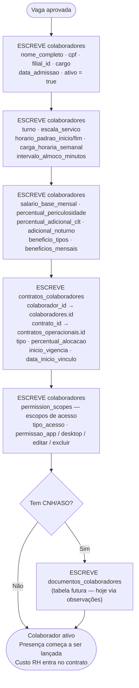

**Interligações geradas:**
| Módulo seguinte | Como se conecta |
|---|---|
| Presença Diária | `colaboradores.id` é buscado diariamente por filial |
| Custo de Contrato | `contratos_colaboradores.percentual_alocacao` entra no cálculo de custo |
| Horas Extras | `colaboradores.id` + `filial_id` são FK na tabela `horas_extras` |
| Eventos RH | `colaboradores.id` é FK em `eventos_rh` |

**Campos críticos:**
| Campo | Tabela | Detalhe |
|---|---|---|
| `escala_servico` | colaboradores | Define dias úteis — usado em presença e cálculo de dias |
| `salario_base_mensal` | colaboradores | Base para custo no dashboard de contratos |
| `percentual_alocacao` | contratos_colaboradores | % do custo imputado ao contrato |
| `inicio_vigencia` | contratos_colaboradores | Início do vínculo com o contrato operacional |

---

## 2. Planejamento e Aprovação de Férias (RH)

**Início:** RH identifica período aquisitivo &nbsp;→&nbsp; **Fim:** Presença atualizada automaticamente

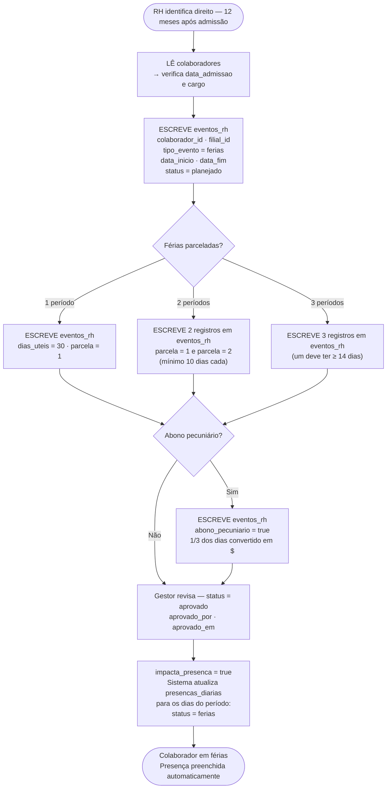

**Interligações:**
| Módulo | Como se conecta |
|---|---|
| Presença Diária | `eventos_rh.impacta_presenca = true` → `presencas_diarias.status = 'ferias'` para cada dia do período |
| Cálculo de custo | Dias de férias entram no cálculo de encargos no dashboard de contratos |

**Campos críticos:**
| Campo | Tabela | Detalhe |
|---|---|---|
| `tipo_evento` | eventos_rh | ferias · afastamento · licenca · atestado · folga_programada · suspensao |
| `impacta_presenca` | eventos_rh | true = preenche presença automaticamente no período |
| `parcela` | eventos_rh | 1, 2 ou 3 — cada parcela é um registro separado |
| `abono_pecuniario` | eventos_rh | true = 1/3 dos dias viram dinheiro (CLT art. 143) |
| `dias_uteis` | eventos_rh | Dias úteis do período (excluindo fins de semana e feriados) |

---

## 3. Horas Extras — Solicitação e Aprovação (RH/Operação)

**Início:** Colaborador ou gestor registra HE &nbsp;→&nbsp; **Fim:** HE aprovada e disponível para fechamento

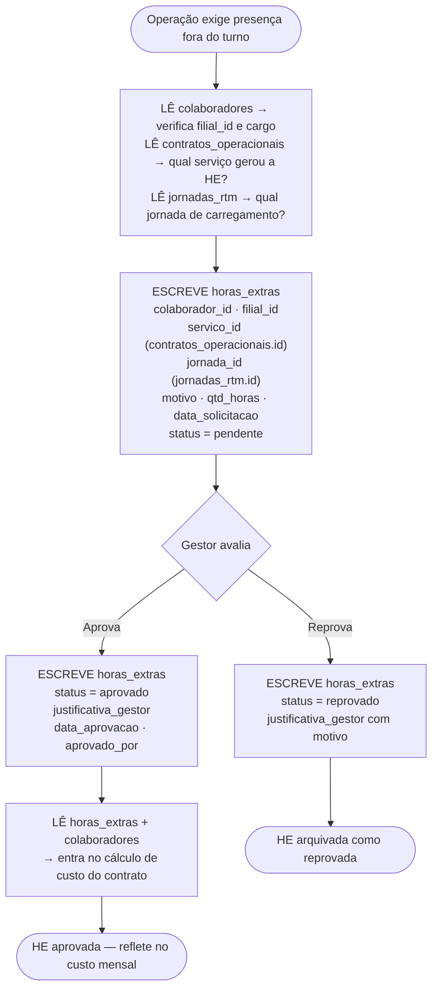

**Interligações:**
| Módulo | Como se conecta |
|---|---|
| Contratos Operacionais | `horas_extras.servico_id` → `contratos_operacionais.id` — HE é rateada no custo do contrato |
| Carregamento RTM | `horas_extras.jornada_id` → `jornadas_rtm.id` — HE originada de uma jornada específica |
| Presença Diária | Colaborador com HE aprovada pode ter `presencas_diarias.status = 'presente'` no mesmo dia com observação |

**Campos críticos:**
| Campo | Tabela | Detalhe |
|---|---|---|
| `qtd_horas` | horas_extras | Decimal (ex: 1.5 = 1h30min) |
| `servico_id` | horas_extras | Qual contrato/serviço gerou a necessidade |
| `status` | horas_extras | pendente → aprovado ou reprovado |
| `aprovado_por` | horas_extras | UUID do usuário aprovador (auth.users) |

---

## 4. Desligamento de Colaborador (RH)

**Início:** Decisão de desligamento &nbsp;→&nbsp; **Fim:** Colaborador inativo, acesso revogado

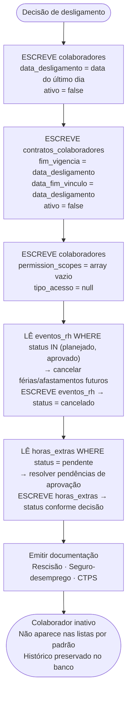

**Interligações:**
| Módulo | O que muda |
|---|---|
| Presença Diária | `colaboradores.ativo = false` → não aparece mais no lançamento diário |
| Contratos | `contratos_colaboradores.ativo = false` → sai do cálculo de custo do contrato |
| Horas Extras | Pendências devem ser encerradas antes do desligamento |

---

## 5. Presença Diária (Operação)

**Início:** Início do dia de trabalho &nbsp;→&nbsp; **Fim:** Presença registrada com status correto para todos

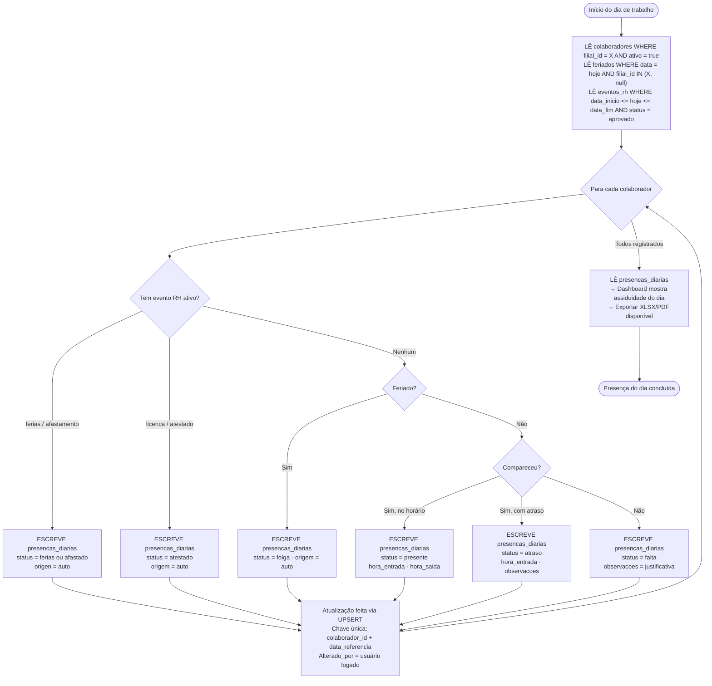

**Interligações:**
| Módulo | Como se conecta |
|---|---|
| Eventos RH | `eventos_rh.impacta_presenca = true` → preenche automático; status copiado para `presencas_diarias.status` |
| Feriados | `feriados` tabela — dia é checado antes de lançar falta |
| Horas Extras | HE aprovada no mesmo dia: `presencas_diarias.status = presente` com observação |
| Dashboard | `presencas_diarias` alimenta indicadores de assiduidade por filial e contrato |
| Exportação | `/api/presenca-mes-xlsx`, `/api/presenca-calendario-massa-xlsx`, `/api/presenca-calendario-pdf` |

**Campos críticos:**
| Campo | Tabela | Detalhe |
|---|---|---|
| `status` | presencas_diarias | presente · falta · folga · atraso · atestado · ferias · afastado · pendente |
| `data_referencia` | presencas_diarias | Data do registro — chave junto com `colaborador_id` |
| `origem` | presencas_diarias | manual (digitado pelo gestor) · app (registrado pelo colaborador) · auto (evento RH/feriado) |
| `alterado_por` | presencas_diarias | UUID do usuário que fez a última alteração |

---

## 6. Contrato Operacional — Equipe e Custos

**Início:** Novo contrato com cliente &nbsp;→&nbsp; **Fim:** Custo real monitorado mensalmente

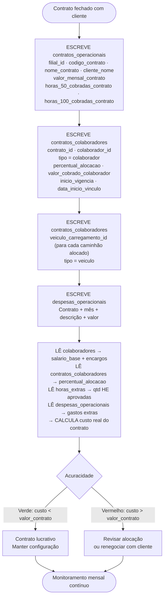

**Interligações:**
| Módulo | Como se conecta |
|---|---|
| Colaboradores | `contratos_colaboradores.colaborador_id` → salário e encargos entram no custo |
| Horas Extras | `horas_extras.servico_id` → HE aprovadas são somadas ao custo do contrato |
| Carregamento RTM | `jornadas_rtm.contrato_id` → jornadas de carregamento são vinculadas ao contrato |
| Despesas | `despesas_operacionais.contrato_id` → gastos avulsos do mês |

---

## 7. Operação de Carregamento RTM (Diária)

**Início:** Início do turno &nbsp;→&nbsp; **Fim:** Jornada fechada com bonificação calculada

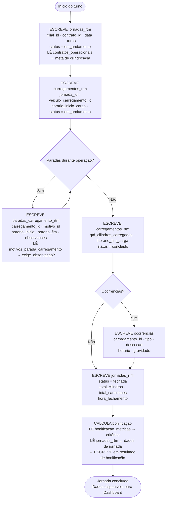

**Interligações:**
| Módulo | Como se conecta |
|---|---|
| Contratos Operacionais | `jornadas_rtm.contrato_id` → meta de cilindros definida em `contratos_operacionais` |
| Horas Extras | `horas_extras.jornada_id` → HE gerada por uma jornada específica |
| Veículos | `carregamentos_rtm.veiculo_carregamento_id` → veículo usado no carregamento |
| Motivos de Parada | `paradas_carregamento_rtm.motivo_id` → `motivos_parada_carregamento.id` |

---

## 8. Documentos de Frota (Frota)

**Início:** Cadastro de documento do veículo &nbsp;→&nbsp; **Fim:** Alerta de vencimento e renovação

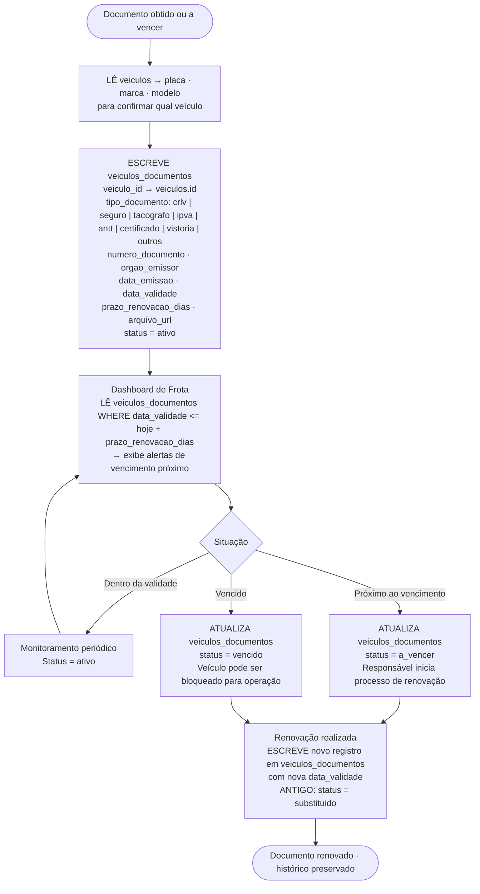

**Interligações:**
| Módulo | Como se conecta |
|---|---|
| Veículos | `veiculos_documentos.veiculo_id` → `veiculos.id` — todo documento pertence a um veículo |
| Dashboard Frota | `/api/dashboard/frota` lê documentos próximos ao vencimento |
| Manutenção | Documentos vencidos (tacógrafo, ANTT) podem originar OS de manutenção preventiva |

**Campos críticos:**
| Campo | Tabela | Detalhe |
|---|---|---|
| `tipo_documento` | veiculos_documentos | crlv · seguro · tacografo · ipva · antt · certificado · vistoria · outros |
| `data_validade` | veiculos_documentos | Data de expiração — base para alertas |
| `prazo_renovacao_dias` | veiculos_documentos | Quantos dias antes do vencimento gera alerta |
| `status` | veiculos_documentos | ativo · a_vencer · vencido · substituido |

---

## 9. Manutenção de Veículo (OS)

**Início:** Problema identificado ou manutenção programada &nbsp;→&nbsp; **Fim:** OS encerrada, compras registradas

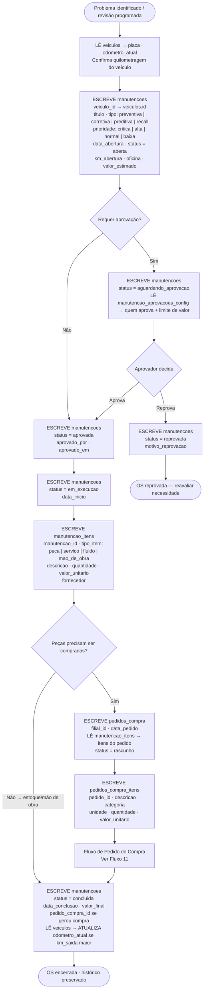

**Interligações:**
| Módulo | Como se conecta |
|---|---|
| Veículos | `manutencoes.veiculo_id` → `veiculos.id`; odômetro atualizado ao concluir |
| Pedidos de Compra | `manutencoes.pedido_compra_id` → `pedidos_compra.id` (gerado para as peças) |
| Pneus | Pneu com `status = trocar` origina OS de manutenção |
| Documentos de Frota | Tacógrafo vencido pode gerar OS preventiva |

---

## 10. Controle de Pneus (Frota)

**Início:** Instalação de pneu novo &nbsp;→&nbsp; **Fim:** Pneu descartado após vida útil

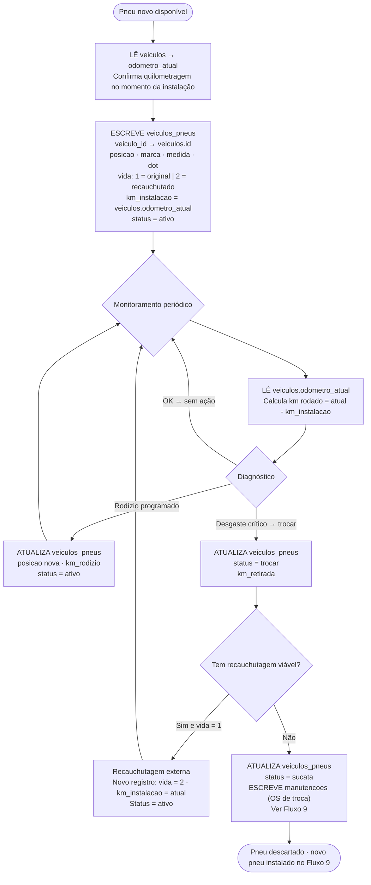

**Interligações:**
| Módulo | Como se conecta |
|---|---|
| Veículos | `veiculos_pneus.veiculo_id` + lê `veiculos.odometro_atual` para calcular km rodado |
| Manutenção | `status = trocar` → gera OS de manutenção corretiva |
| Pedidos de Compra | OS de troca de pneu → pedido de compra para aquisição |

---

## 11. Abastecimento de Veículo (Frota)

**Início:** Veículo vai abastecer &nbsp;→&nbsp; **Fim:** Consumo registrado e dashboard atualizado

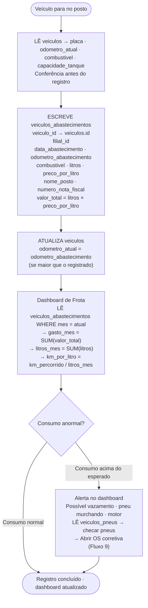

**Interligações:**
| Módulo | Como se conecta |
|---|---|
| Veículos | `veiculos_abastecimentos.veiculo_id`; `veiculos.odometro_atual` atualizado |
| Dashboard Frota | `/api/dashboard/frota` agrega abastecimentos por mês |
| Manutenção | Consumo alto → OS corretiva |
| Pneus | Pneu com baixa calibragem aumenta consumo — checagem cruzada |

---

## 12. Pedido de Compra (Financeiro)

**Início:** Necessidade identificada &nbsp;→&nbsp; **Fim:** Pagamento registrado, nota vinculada

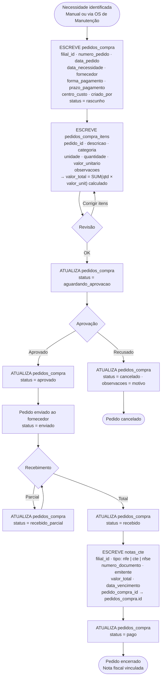

**Interligações:**
| Módulo | Como se conecta |
|---|---|
| Manutenção | `manutencoes.pedido_compra_id` → gerado para compra de peças |
| Notas CTE | `notas_cte.pedido_compra_id` → vínculo com a nota fiscal do fornecedor |
| Dashboard | Pedidos aprovados entram em DRE e fluxo de caixa |

---

## 13. Gestão de Escopos e Permissões (Admin)

**Início:** Admin configura escopos &nbsp;→&nbsp; **Fim:** Colaborador vê apenas o que tem permissão

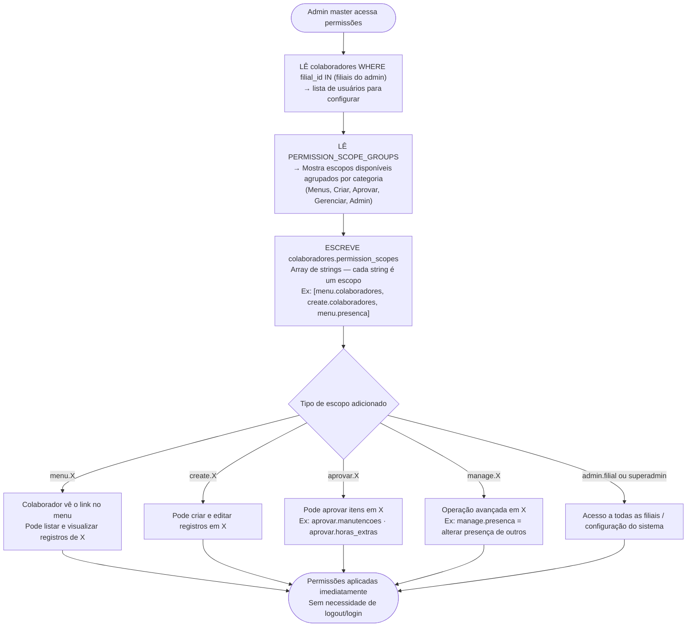

**Tabela completa de escopos:**
| Módulo | Ver | Criar/Editar | Aprovar | Gerenciar |
|---|---|---|---|---|
| Colaboradores | `menu.colaboradores` | `create.colaboradores` | — | — |
| Contratos Operacionais | `menu.contratos_operacionais` | `create.contratos_operacionais` | — | — |
| Contratos Colaboradores | `menu.contratos_colaboradores` | `create.contratos_colaboradores` | — | — |
| Presença | `menu.presenca` | — | — | `manage.presenca` |
| Eventos RH | `menu.eventos_rh` | `create.eventos_rh` | — | — |
| Horas Extras | `menu.horas_extras` | `create.horas_extras` | `aprovar.horas_extras` | — |
| Carregamento | `menu.carregamento` | — | — | `manage.programacao_carregamento` |
| Veículos | `menu.veiculos` | `create.veiculos` | — | — |
| Documentos de Frota | `menu.veiculos_documentos` | `create.veiculos_documentos` | — | — |
| Abastecimentos | `menu.abastecimentos` | `create.abastecimentos` | — | — |
| Pneus | `menu.pneus` | `create.pneus` | — | — |
| Manutenções | `menu.manutencoes` | `create.manutencoes` | `aprovar.manutencoes` | — |
| Pedidos de Compra | `menu.pedidos_compra` | `create.pedidos_compra` | — | — |
| Notas CTE | `menu.notas_cte` | `create.notas_cte` | — | — |
| Estoque | `menu.estoque` | `create.estoque` | — | — |
| Filiais | `menu.filiais` | `create.filiais` | — | — |
| Permissões | `menu.permissoes` | — | — | `manage.permissoes` |
| Auditoria | `menu.auditoria` | — | — | — |

---

## Referência Rápida — Tabelas e Módulos

| Tabela | Módulo no SEG | Ligada a |
|---|---|---|
| `colaboradores` | RH → Colaboradores | filiais, contratos, presença, eventos, horas_extras |
| `contratos_operacionais` | RH → Contratos Operacionais | colaboradores (via CC), jornadas, horas_extras |
| `contratos_colaboradores` | RH → Contratos → Equipe | colaboradores, contratos_operacionais |
| `eventos_rh` | RH → Eventos RH | colaboradores → presencas_diarias (auto) |
| `presencas_diarias` | Operação → Presença | colaboradores, filiais, eventos_rh |
| `horas_extras` | RH → Horas Extras | colaboradores, filiais, contratos_operacionais, jornadas_rtm |
| `jornadas_rtm` | Operação → Carregamento | contratos_operacionais, veiculos_carregamento |
| `veiculos` | Frota → Veículos | filiais, abastecimentos, pneus, manutencoes, documentos |
| `veiculos_documentos` | Frota → Documentos de Frota | veiculos |
| `veiculos_abastecimentos` | Frota → Abastecimentos | veiculos, filiais |
| `veiculos_pneus` | Frota → Pneus | veiculos → manutencoes |
| `manutencoes` | Frota → Manutenções | veiculos, pedidos_compra, manutencao_itens |
| `pedidos_compra` | Financeiro → Pedidos de Compra | filiais, manutencoes, notas_cte |
| `notas_cte` | Financeiro → Notas CTE | filiais, pedidos_compra |

---

*SEG v2.0 — Gerado em 2026-05-12. Atualizar a cada nova funcionalidade implementada.*
